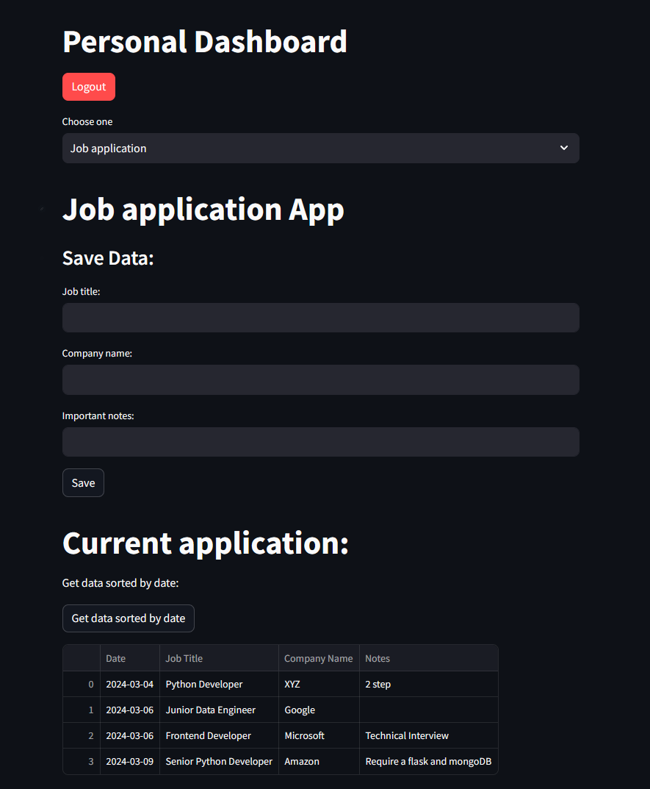

# Personal-Data-Platform
Create your own space in Personal Data Platform.



## Description

This project is aimed at implementing a login-system app to get into personal dashboard 
which include job application app, personal calendar and to do list. Every page is connected with PostgreSQL database.


## Technologies
Project is created with:
* Streamlit
* PostgreSQL
* Pandas
	
## Setup
To run this project, install it locally using:

```
$ pip install -r requirement.txt
$ streamlit run app.py
```
